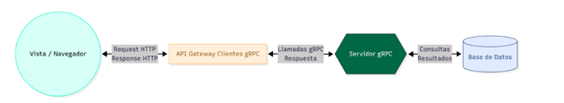
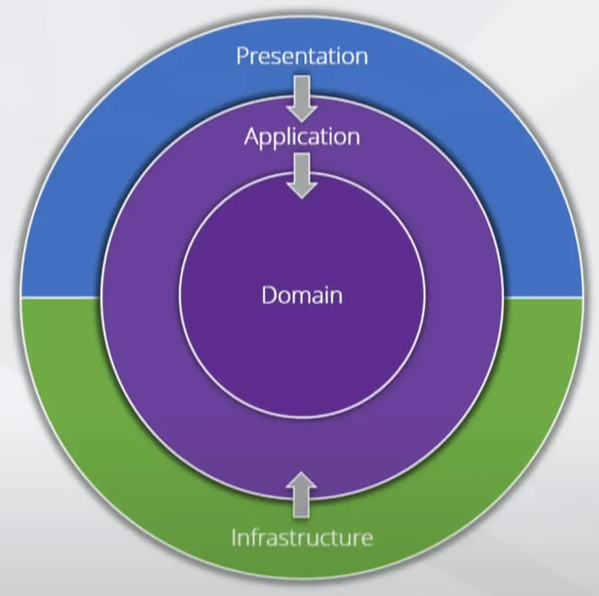

# Empuje Comunitario - Backend Java

### Basic Arquitecture


## Software Development Agreements
- Respecting **SOLID** principles in code design.
- Following **Clean Code** practices for readability and maintainability.
- Designing software following **Clean / Hexagonal Architecture** principles.



## Starting the project

## DB with Docker
docker run --name postgres-db -e POSTGRES_USER=postgres -e POSTGRES_PASSWORD={your_password} -e POSTGRES_DB=empuje -p 5435:5432 -d postgres:latest

## Mail service with Docker
docker run -d -p 1025:1025 -p 8025:8025 mailhog/mailhog

## Run the application

```bash
./gradlew build
./gradlew bootRun
```


### Reference Documentation
For further reference, please consider the following sections:

* [Official Gradle documentation](https://docs.gradle.org)
* [Spring Boot Gradle Plugin Reference Guide](https://docs.spring.io/spring-boot/3.5.5/gradle-plugin)
* [Create an OCI image](https://docs.spring.io/spring-boot/3.5.5/gradle-plugin/packaging-oci-image.html)
* [Spring Web](https://docs.spring.io/spring-boot/3.5.5/reference/web/servlet.html)
* [Spring Data JPA](https://docs.spring.io/spring-boot/3.5.5/reference/data/sql.html#data.sql.jpa-and-spring-data)
* [Spring gRPC](https://docs.spring.io/spring-grpc/reference/index.html)
* [Spring Security](https://docs.spring.io/spring-boot/3.5.5/reference/web/spring-security.html)
